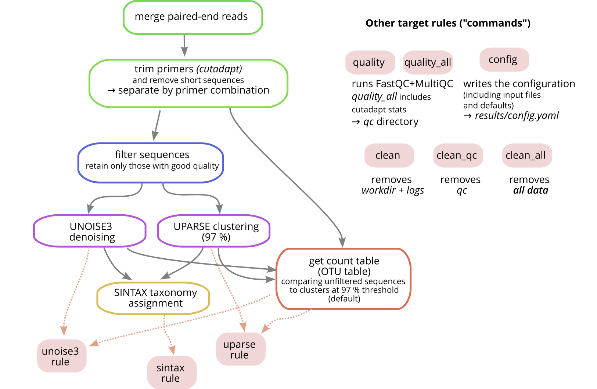

# USEARCH/VSEARCH-based pipeline for amplicon data processing

This [Snakemake](https://snakemake.github.io) workflow aims at providing a simple way for clustering/denoising paired-end Illumina sequences with [USEARCH](https://drive5.com/usearch) and/or [VSEARCH](https://github.com/torognes/vsearch).

## Features

* *Standard pipeline*: Paired-end read merging, primer trimming, UNOISE3/UPARSE clustering and SINTAX taxonomy assignment
* Both USEARCH and VSEARCH can be used (configurable individually at every step)
* *Multiple primer combinations* can be recognized using [Cutadapt](https://cutadapt.readthedocs.io), and subsequent clustering/taxonomy assignment is done separately for every amplicon
* Quality control using [FastQC](https://www.bioinformatics.babraham.ac.uk/projects/fastqc) and [MultiQC](https://multiqc.info)
* Optimized for large projects with many samples (samples are *processed in parallel*, beneficial if running on a cluster)

## Workflow

The workflow follows the [recommendations](https://drive5.com/usearch/manual/uparse_pipeline.html) by the author of USEARCH. Primer trimming is done wiwth Cutadapt. 

The results will usually differ slightly depending on whether VSEARCH or USEARCH is used for different steps. The UPARSE algorithm is not available in VSEARCH.



## Installation (UNIX)

The following approach assumes [Mamba](https://github.com/mamba-org/mamba) to be installed as the Conda package manager:

```sh
# install Snakemake
mamba create -c conda-forge -c bioconda --name snakemake snakemake snakedeploy
conda activate snakemake

# initialize project working directory
mkdir -p path/to/project_dir
cd path/to/project_dir

snakedeploy deploy-workflow https://github.com/markschl/uvsnake . --tag v0.1
```

## Configuration

After initialization, a `config` directory is found in the project directory. It contains `config.yaml` and `samples.tsv`, which both have to be adjusted to your needs (see illustration). More details on the configuration and how to easily create a sample file [are found here](config):


## Running

```sh
conda activate snakemake  # if not already activated
cores=10
```

To run FastQC/MultiQC (results in the `qc` directory):

```sh
snakemake --use-conda --cores $cores quality
```

To run UNOISE3 and UPARSE (output in `results/<fwd-primer>...<reverse-primer>/` directory):

```sh
snakemake --use-conda --cores $cores unoise3 uparse
```


Assign taxonomy with SINTAX:

```sh
snakemake --use-conda --cores $cores sintax
```

This adds some more files with tabular output, as well as taxonomy-annotated BIOM files:

```
results/
 ├─ fwd_primer...rev_primer/
 │  ├─ unoise3_sintax.txt.gz
 │  ├─ unoise3_sintax_taxtab.txt.gz
 │  ├─ unoise3_sintax.biom.gz
 │  ├─ uparse_sintax.txt.gz
 │  ├─ uparse_sintax_taxtab.txt.gz
 │  ├─ uparse_sintax.biom.gz
 │  ├─ (...)
```

**Note**: The *taxonomy* rule should not be run together with the *unoise3* and/or *uparse* rules, but in a separate command *afterwards*. Taxonomic assignments are only done for clusters that are already present. If run before clustering, nothing happens.

## `uvsnake` script

There is a simple script that runs Snakemake with a few default options to save some typing, but otherwise behaves exactly like Snakemake. It becomes especially useful on clusters (see below).

We first need to download the script (UNIX):

```sh
wget https://raw.githubusercontent.com/markschl/uvsnake/v0.1/uvsnake
chmod +x uvsnake
```

The command looks similar to the `snakemake` command above:

```sh
./uvsnake --cores $cores unoise3 uparse
```

Internally, a few additional arguments are added to the `snakemake` call (always printed when executing), the most important being: `--rerun-incomplete --use-conda --conda-prefix  ~/uvsnake/conda`. These make sure that Conda is always used, and the packages are installed at a common location `<user home>/uvsnake/conda`. 

### Cluster execution

Executing on computer clusters requires [additional settings](https://snakemake.readthedocs.io/en/stable/executing/cluster.html). Here, using the `uvsnake` script (previous chapter) is a good idea, since it assists with setting resource constraints on computer clusters and grouping small sample processing jobs into batches. The latter is important because submitting every single sample processing step as job is very inefficient.

 *Note*: an altenative would be to use [profiles](https://snakemake.readthedocs.io/en/latest/executing/cli.html#profiles), see [this example](https://github.com/jdblischak/smk-simple-slurm/blob/main/examples/job-grouping/simple/config.yaml). This may be better documented in the future.

It may also make sense to restart failed jobs with `-T/--retries`, in case they failed because of time/memory constraints being too conservative. Here an example running on a SLURM cluster with a total of three tries and a maximum of 100 parallel sample processing jobs:

```sh
./uvsnake --slurm --cores all --jobs 10 --retries 3 quality unoise3 uparse
```

## Example

The [`mock_example` directory](mock_example) contains an example dataset and shows how this pipeline is validated and how the data can be analyzed in R.
