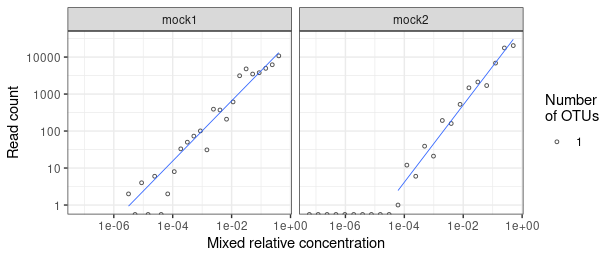

# Mock community analysis

``` r
library(phyloseq)
library(tidyverse)
library(ggplot2)
theme_set(theme_bw())
options(knitr.kable.NA = "")
```

## Read data

We read the BIOM file containing the OTU table from the UNOISE3
clustering, as well as the SINTAX taxonomic assignments into a Phyloseq
object:

``` r
res_dir <- "../results/ITS3-KYO2...ITS4"
physeq <- import_biom(file.path(res_dir, "unoise3_sintax.biom.gz"))
colnames(tax_table(physeq)) <- c("kingdom", "phylum", "class", "order", "family", "genus", "species")
physeq
```

    ## phyloseq-class experiment-level object
    ## otu_table()   OTU Table:         [ 21 taxa and 2 samples ]
    ## tax_table()   Taxonomy Table:    [ 21 taxa by 7 taxonomic ranks ]

In order to get the species names and mixed relative concentrations for
the 24 isolates, we read the metadata and the OTU -\> isolate mapping
(done with VSEARCH after running the pipeline).

``` r
meta = read_tsv("../mock/mock_data.txt")
```

    ## Rows: 24 Columns: 10
    ## ── Column specification ──────────────────────────────────────────────────────────────────────────────────────────────────────────────────────────────────────────────────────────────────────
    ## Delimiter: "\t"
    ## chr (1): name
    ## dbl (9): num, n0_qpcr, n0_se_qpcr, conc_even, rel_abund_m1, rel_abund_m2, IT...
    ## 
    ## ℹ Use `spec()` to retrieve the full column specification for this data.
    ## ℹ Specify the column types or set `show_col_types = FALSE` to quiet this message.

``` r
otu_map = read_tsv(file.path(res_dir, "mock_cmp.txt"),
                   col_names=c("OTU", "isolate", "ident"))
```

    ## Rows: 21 Columns: 3
    ## ── Column specification ──────────────────────────────────────────────────────────────────────────────────────────────────────────────────────────────────────────────────────────────────────
    ## Delimiter: "\t"
    ## chr (2): OTU, isolate
    ## dbl (1): ident
    ## 
    ## ℹ Use `spec()` to retrieve the full column specification for this data.
    ## ℹ Specify the column types or set `show_col_types = FALSE` to quiet this message.

``` r
meta = meta %>% 
  select(isolate=name, mock1_rel=rel_abund_m1, mock2_rel=rel_abund_m2) %>% 
  left_join(otu_map, "isolate")

meta
```

<div class="kable-table">

| isolate             | mock1_rel | mock2_rel | OTU    | ident |
|:--------------------|----------:|----------:|:-------|------:|
| H_crustiliniforme   |  2.40e-01 |  9.77e-04 | Zotu6  |   100 |
| C_puteana           |  1.44e-01 |  6.25e-02 | Zotu7  |   100 |
| F_pinicola          |  5.22e-04 |  1.25e-01 | Zotu4  |   100 |
| H_annosum           |  3.14e-04 |  7.81e-03 | Zotu12 |   100 |
| E_hasegawianum      |  4.00e-01 |  3.80e-06 | Zotu3  |   100 |
| C_flavescens        |  8.71e-04 |  3.13e-02 | Zotu10 |   100 |
| Septoria_sp         |  1.12e-02 |  2.00e-07 | Zotu11 |   100 |
| A_pullulans         |  2.44e-05 |  1.95e-03 | Zotu14 |   100 |
| Boeremia_sp_1       |  4.06e-05 |  3.05e-05 |        |       |
| Boeremia_sp_2       |  3.11e-02 |  1.56e-02 | Zotu5  |   100 |
| E_nigrum            |  1.88e-04 |  1.00e-06 | Zotu19 |   100 |
| V_fraxini           |  6.77e-05 |  2.44e-04 | Zotu20 |   100 |
| Penicillium_sp      |  3.20e-06 |  5.00e-01 | Zotu1  |   100 |
| P_fortinii          |  1.13e-04 |  6.10e-05 | Zotu21 |   100 |
| H_fraxineus         |  1.45e-03 |  1.90e-06 | Zotu18 |   100 |
| S_cerevisiae        |  1.87e-02 |  7.60e-06 | Zotu15 |   100 |
| P_vulgaris          |  8.80e-06 |  4.88e-04 | Zotu17 |   100 |
| D_eres              |  8.64e-02 |  5.00e-07 | Zotu8  |   100 |
| C_acutatum          |  2.42e-03 |  2.50e-01 | Zotu2  |   100 |
| F_tritinctum        |  5.18e-02 |  3.91e-03 | Zotu9  |   100 |
| O_minus             |  5.30e-06 |  1.00e-07 |        |       |
| N_serpens           |  6.72e-03 |  1.00e-07 | Zotu16 |   100 |
| Xylariaceae_isolate |  4.03e-03 |  1.22e-04 | Zotu13 |   100 |
| B_tuberculispora    |  1.46e-05 |  1.53e-05 |        |       |

</div>

From the 24 isolates, 21 were matched by at least one OTU. The remaining
ones had a very low relative concentration in the mix and were thus not
detected at the given sequencing depth. In theory, it would be possible
to find more OTUs by lowering the value of `minsize` from the current
value of `3`, at the expense of obtaining artefact OTUs. The sequence
similarity (`ident`) was always 100%, which is optimal.

## Taxonomy

Part of the isolates were assigned at the genus and species levels at a
bootstrap threshold of 0.7, and those names seem mostly correct.

``` r
otus <- as(tax_table(physeq), "matrix")
data.frame(reads=taxa_sums(physeq), otus) %>% 
  rownames_to_column('OTU') %>% 
  arrange(-reads) %>% 
  select(OTU, reads, phylum, genus, species) %>% 
  left_join(meta %>% select(OTU, isolate), 'OTU')
```

<div class="kable-table">

| OTU    | reads | phylum             | genus                | species                         | isolate             |
|:-------|------:|:-------------------|:---------------------|:--------------------------------|:--------------------|
| Zotu1  | 20434 | p\_\_Ascomycota    | g\_\_Penicillium     |                                 | Penicillium_sp      |
| Zotu2  | 18014 | p\_\_Ascomycota    | g\_\_Colletotrichum  |                                 | C_acutatum          |
| Zotu3  | 10780 | p\_\_Basidiomycota | g\_\_Erythrobasidium |                                 | E_hasegawianum      |
| Zotu4  |  6942 | p\_\_Basidiomycota | g\_\_Fomitopsis      |                                 | F_pinicola          |
| Zotu7  |  6651 | p\_\_Basidiomycota | g\_\_Coniophora      | s\_\_Coniophora_puteana         | C_puteana           |
| Zotu5  |  6262 | p\_\_Ascomycota    |                      |                                 | Boeremia_sp_2       |
| Zotu6  |  6219 | p\_\_Basidiomycota | g\_\_Hebeloma        | s\_\_Hebeloma_incarnatulum      | H_crustiliniforme   |
| Zotu8  |  3777 | p\_\_Ascomycota    | g\_\_Diaporthe       |                                 | D_eres              |
| Zotu9  |  3637 | p\_\_Ascomycota    | g\_\_Fusarium        | s\_\_Fusarium_tricinctum        | F_tritinctum        |
| Zotu15 |  3126 | p\_\_Ascomycota    | g\_\_Saccharomyces   |                                 | S_cerevisiae        |
| Zotu10 |  2219 | p\_\_Basidiomycota | g\_\_Papiliotrema    | s\_\_Papiliotrema_flavescens    | C_flavescens        |
| Zotu11 |   613 | p\_\_Ascomycota    |                      |                                 | Septoria_sp         |
| Zotu12 |   577 | p\_\_Basidiomycota | g\_\_Heterobasidion  | s\_\_Heterobasidion_occidentale | H_annosum           |
| Zotu13 |   383 | p\_\_Ascomycota    | g\_\_Rosellinia      |                                 | Xylariaceae_isolate |
| Zotu16 |   209 | p\_\_Ascomycota    |                      |                                 | N_serpens           |
| Zotu14 |   199 | p\_\_Ascomycota    | g\_\_Aureobasidium   | s\_\_Aureobasidium_pullulans    | A_pullulans         |
| Zotu17 |    43 | p\_\_Ascomycota    |                      |                                 | P_vulgaris          |
| Zotu19 |    33 | p\_\_Ascomycota    |                      |                                 | E_nigrum            |
| Zotu18 |    31 | p\_\_Ascomycota    | g\_\_Hymenoscyphus   | s\_\_Hymenoscyphus_fraxineus    | H_fraxineus         |
| Zotu21 |     9 | p\_\_Ascomycota    |                      |                                 | P_fortinii          |
| Zotu20 |     8 | p\_\_Ascomycota    | g\_\_Fusicladium     | s\_\_Fusicladium_proteae        | V_fraxini           |

</div>

## Mixed vs. amplified frequencies

We compare the relative mixed genomic DNA from the different isolates
with their read counts in the sequenced mock communities:

``` r
counts <- otu_table(physeq) %>%
  as.data.frame() %>%
  rownames_to_column("OTU")

mock1 = meta %>% 
  select(isolate, OTU, rel_conc=mock1_rel) %>% 
  left_join(counts %>% select(OTU, reads=mock1), "OTU") %>% 
  mutate(community = "mock1")
mock2 = meta %>% 
  select(isolate, OTU, rel_conc=mock2_rel) %>% 
  left_join(counts %>% select(OTU, reads=mock2), "OTU") %>% 
  mutate(community = "mock2")

# then sum up the OTU counts per isolate
mock_data = bind_rows(mock1, mock2) %>% 
  group_by(community, isolate, rel_conc) %>%
  summarise(
    reads = sum(reads, na.rm=T),
    reads = ifelse(is.na(reads), 0, reads),
    OTUs = paste(unique(na.omit(OTU)), collapse = ","),
    n_otus = n(),
    .groups = "drop"
  ) %>%
  arrange(community, -rel_conc)

head(mock_data)
```

<div class="kable-table">

| community | isolate           | rel_conc | reads | OTUs  | n_otus |
|:----------|:------------------|---------:|------:|:------|-------:|
| mock1     | E_hasegawianum    |   0.4000 | 10780 | Zotu3 |      1 |
| mock1     | H_crustiliniforme |   0.2400 |  6198 | Zotu6 |      1 |
| mock1     | C_puteana         |   0.1440 |  4952 | Zotu7 |      1 |
| mock1     | D_eres            |   0.0864 |  3777 | Zotu8 |      1 |
| mock1     | F_tritinctum      |   0.0518 |  3477 | Zotu9 |      1 |
| mock1     | Boeremia_sp_2     |   0.0311 |  4788 | Zotu5 |      1 |

</div>

The plot of mixed vs. detected frequencies shows a clear relationship.
The *mock2* community is more uneven, concentrations decrease faster
than in mock1, resulting in rare sequence variants (zOTUs) not being
found at the given sequencing depth.

``` r
ggplot(mock_data, aes(rel_conc, reads)) +
  geom_point(aes(size = as.factor(n_otus)), pch = 21, alpha = 0.7) +
  geom_smooth(method = "lm", formula = "y~x", se = F, size = 0.3) +
  facet_grid(~ community) +
  scale_size_discrete(range = c(1, 4)) +
  scale_x_log10() +
  scale_y_log10() +
  labs(
    x = "Mixed relative concentration",
    y = "Read count",
    size = "Number\nof OTUs"
  ) +
  theme_bw() +
  theme(strip.text.y = element_text(angle = 0))
```

<!-- -->
