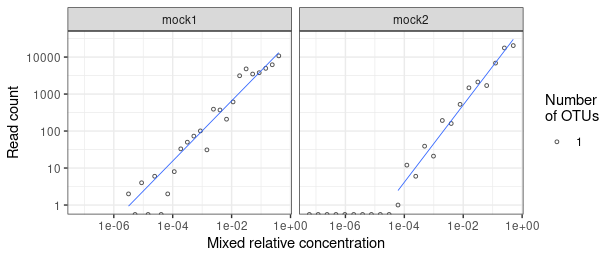

# Test data

These commands download example sequencing data (Illumina NextSeq) from two uneven (staggered) mock communities (Schlegel et al. 2018) into the `test/fastq` directory.

```sh
# define sample URLs
declare -A urls
urls[mock1]=https://ftp.sra.ebi.ac.uk/vol1/fastq/SRR252/024/SRR25280624/SRR25280624
urls[mock2]=https://ftp.sra.ebi.ac.uk/vol1/fastq/SRR252/020/SRR25280620/SRR25280620

# download
mkdir -p test/fastq
for sample in ${!urls[@]}; do
  url_prefix=${urls[$sample]}
  echo "$url_prefix > $sample"
  wget -O test/fastq/"$sample"_R1.fastq.gz "$url_prefix"_1.fastq.gz
  wget -O test/fastq/"$sample"_R2.fastq.gz "$url_prefix"_2.fastq.gz
done
```

## Download taxonomy database

For taxonomic assignments (`sintax` command, see next chapter), we download all Eukaryota ITS reference sequences the UNITE database. Here, we use the more strictly filtered dataset (doesn't contain all singletons) (https://doi.org/10.15156/BIO/2938081):

```sh
url=https://files.plutof.ut.ee/public/orig/1C/C2/1CC2477429B3A703CC1C7A896A7EFF457BB0D471877CB8D18074959DBB630D10.tgz
wget --no-check-certificate -O unite.tar.gz $url
mkdir -p unite
tar -C unite -xzf unite.tar.gz

# we use the clusters with a dynamic threshold
fasta=unite/*_dynamic_*.fasta
taxonomy=unite/*_dynamic_*.txt

# We clean the taxonomy, converting undefined names to 'rank__' with an
# empty name. The pipeline will then drop those empty ranks, as SINTAX does
# not need all ranks to be defined.
# Also, we remove the 'sh' (species hypothesis) rank, because it is not needed
# (only one sequence per SH) and because the two-letter 'sh' code causes problems
# with USEARCH
cat $taxonomy |
  sed -E 's/([a-z])__[^;]+?_Incertae_sedis;/\1__;/g' |  # clean intermediate ranks
  sed -E 's/s__.+?_sp;sh__/s__;sh__/g' | # clean undefined species names
  sed -E 's/;sh__.*//g' `# remove 'sh' rank` \
  > unite/tax.txt

# Subsequently, we use https://github.com/markschl/seqtool to add the taxonomy to the
# FASTA headers.
# Also, in this case we remove (potentially) poorly annotated sequences,
# which have no known order name
# In this example, 178141 of 234479 sequences are retained
st set -d '{l:2}' -ul unite/tax.txt $fasta |
  st find --exclude --desc --regex ';o__;f__;g__;s__$' |
  gzip -c > test/unite_refs.fasta.gz

# clean up
rm -R unite unite.tar.gz
```

## Running the denoising/clustering pipeline

These commands run all the clustering workflows (on a local computer) and visualize the results (see `test/R_example/example.Rmd` and the [analysis output](R_example/example.md)). This needs to be done in the 'uvsnake' directory.

Note that by default, `uvsnake` does not do any parallel processing. In our case this is intended, since the analysis outcome is always the same, except for SINTAX, which does random bootstrapping. To use multiple parallel processes, specify their number with the `-c/--cores` argument. 


```sh
conda activate snakemake

# Run the UNOISE3 and UPARSE pipelines
# (using VSEARCH, as configured in test/config/config.yaml)
./uvsnake -d test unoise3 uparse

# Now, we can assign the taxonomy using the 'sintax' rule
# using the previously assembled database
./uvsnake -d test sintax

# We may also compare the results with the expected sequences using
# VSEARCH -usearch_global
# This allows us to match the known isolates with the observed OTUs
out=test/results/ITS3-KYO2...ITS4
vsearch --usearch_global $out/unoise3.fasta \
  --db test/mock/mock_ITS2.fasta \
  --userout $out/mock_cmp.txt \
  --userfields 'query+target+id' \
  --id 0.97 \
  --threads 1

## render the example Rmd (requires pandoc in PATH or RSTUDIO_PANDOC set, here for Ubuntu)
# If this doesn't work, you can still directly run the document in RStudio
export RSTUDIO_PANDOC=/usr/lib/rstudio/resources/app/bin/quarto/bin/tools
Rscript -e "rmarkdown::render('test/R_example/example.Rmd', 'github_document')"

# (optional) remove working directory and logs
./uvsnake -d test clean

# the following command removes everything (INCLUDING the results directory)
./uvsnake -d test clean_all
```

This figure from the [`R_example`](R_example/example.md) analysis shows that the mixed relative genomic DNA concentration of the isolates corresponds well to the relative read abundance in the samples.




## Validation using example workflows

In order to further carefully validate this software, the test data was further analyzed using example scripts from the online documentation of the different tools, currently:

* [USEARCH pipeline](https://www.drive5.com/usearch/manual/ex_miseq_its.html) for MiSeq 2x300 fungal ITS. Results were found to be slightly different due to differences in sequence order, resulting in one OTU being different in the UPARSE pipeline (explanation see [the script itself](../scripts/simple/compare.sh)).
* [VSEARCH "alternative" pipeline](https://github.com/torognes/vsearch/wiki/Alternative-VSEARCH-pipeline/c4859786f05bba35d8c306de4a3d64fea40d9dbf) slightly modified to use UNOISE3 following the [this description](https://github.com/torognes/vsearch/pull/283). Like the USEARCH approach, the VSEARCH "alternative" pipeline contains an extra step of read mapping against the OTUs to obtain the count table, using quality filtered reads in this case. The workflow from this repository maps the raw/unfiltered reads instead (with a 97% identity threshold), [as recommended by the USEARCH author](https://www.drive5.com/usearch/manual/cmd_otutab.html). In the future, this should be configurable.

The following script runs this pipeline vs. the "simple" workflows and compares the results:

```sh
# if running for the first time, do this first:
# conda env create -f scripts/simple/uvsearch_env.yaml
scripts/simple/compare.sh
```

## Reference

Schlegel, M., Queloz, V., and Sieber, T. N. (2018). The endophytic mycobiome of European ash and sycamore maple leaves – geographic patterns, host specificity and influence of ash dieback. *Frontiers in Microbiology* 9. doi: 10.3389/fmicb.2018.02345.
